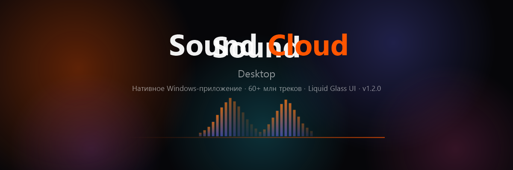

<div align="center">



<br/>

[](https://github.com/LazerProOk1/soundcloud_mod/releases/latest)
[](https://github.com/LazerProOk1/soundcloud_mod/releases/latest)
[](https://tauri.app)
[](https://react.dev)

<br/>

**Слушай 60+ миллионов треков без браузера — быстро, удобно, офлайн.**

Нативное приложение вместо вкладки браузера. SoundCloud как он должен быть.

</div>

---

## Почему не браузер?

| | Браузер | SoundCloud Desktop |
|---|:---:|:---:|
| Медиа-клавиши | ❌ | ✅ |
| Системный трей | ❌ | ✅ |
| Офлайн-режим | ❌ | ✅ |
| Мини-плеер поверх окон | ❌ | ✅ |
| Discord Rich Presence | ❌ | ✅ |
| Жрёт RAM | 500–900 МБ | ~120 МБ |
| Реклама | ✅ | ❌ |
| Нативный UI | ❌ | ✅ |

---

## Возможности

### 🎵 Плеер
- Очередь с перетаскиванием, история прослушиваний
- **Мини-плеер** — компактное окно поверх всех остальных
- Кроссфейд между треками, нормализация громкости
- **10-полосный эквалайзер** с пресетами
- Медиа-клавиши клавиатуры, управление из системного трея
- Полноэкранный плеер с обложкой и лирикой

### 🌊 SoundWave — умная лента
- Персональные рекомендации на основе твоих вкусов
- Бесконечная лента: алгоритм учится с каждым лайком и дизлайком
- Фильтр по языкам, сохранение сессии при переключении страниц
- Крупная обложка 220px, красивая анимация Syne ExtraBold

### 📥 Офлайн и кэш
- Кэширование аудио для мгновенного переключения треков
- **Офлайн-режим** — скачивай любимые треки и слушай без интернета
- Отдельное хранилище для лайкнутых треков (не вытесняются кэшем)

### 🎤 Лирика
- Синхронизированная лирика с покарактерной анимацией (karaoke-стиль)
- Авто-прокрутка, визуализатор, паузы между строфами
- Источники: LRCLib + SoundCloud embedded

### 🎨 Liquid Glass UI
- Эффект жидкого стекла: backdrop-filter + дифференциальный свет
- Живой фон AmbientMesh — 5 анимированных blob-градиентов
- Динамический фон из цветов обложки (k-means кластеризация)
- Кастомный фон: своё изображение + blur + прозрачность
- Syne ExtraBold для заголовков, Manrope для текста

### 🔗 Интеграции
- **Discord Rich Presence** — трек, артист, обложка, таймер в статусе
- **Direct Mode** — напрямую через SoundCloud API без посредников
- **Импорт из Яндекс Музыки** — перенеси библиотеку одной кнопкой
- QR-код для управления с телефона

### 🌍 Локализация
- Полный русский и английский интерфейс
- Установщик на русском языке

---

## Установка

<div align="center">

### [⬇ Скачать последний релиз](https://github.com/LazerProOk1/soundcloud_mod/releases/latest)

</div>

1. Скачай `SoundCloud Desktop_1.2.0_x64-setup.exe` из [релизов](https://github.com/LazerProOk1/soundcloud_mod/releases/latest)
2. Запусти установщик (Windows защита — нажми «Подробнее» → «Всё равно запустить»)
3. Войди через SoundCloud аккаунт или используй Direct Mode с OAuth токеном

**Требования:** Windows 10/11 x64, ~200 МБ места

---

## Direct Mode (без посредников)

Обычный режим работает через прокси-сервер. **Direct Mode** — напрямую через официальный SoundCloud API:

1. Открой Settings → Direct Mode
2. Вставь OAuth токен из [soundcloud.com](https://soundcloud.com) (F12 → Application → Cookies → `oauth_token`)
3. Всё — приложение работает без посредников, без ограничений

---

## Сборка из исходников

```bash
# Клонировать
git clone https://github.com/LazerProOk1/soundcloud_mod.git
cd soundcloud_mod/desktop

# Зависимости
pnpm install

# Режим разработки
pnpm tauri dev

# Production-сборка (NSIS установщик)
pnpm tauri build
```

**Требуется:** Node.js 20+, pnpm 10, Rust stable, Windows 10/11 x64

---

## Стек

| Слой | Технология |
|---|---|
| Оболочка | Tauri 2 (Rust) |
| UI | React 19 + TypeScript |
| Стили | Tailwind CSS v4 |
| Состояние | Zustand 5 + TanStack Query v5 |
| Аудио | Rust `rodio` + `rubato` (pitch/speed) |
| Эквалайзер | Rust 10-band EQ |
| Шрифты | Syne ExtraBold + Manrope Variable |
| Установщик | NSIS (русский язык) |

---

## Что нового в v1.2.0

- ✨ **SoundWave редизайн** — крупная обложка, сессия не сбрасывается при навигации
- 🪟 **Liquid Glass v2** — жанровые фильтры, очередь и чипы теперь стеклянные
- 🇷🇺 **Русский установщик** — NSIS с кастомными изображениями
- 🌈 **AmbientMesh** — 5-й blob заполняет центр, стекло видно по всей высоте
- 🔠 **Шрифт** — Syne ExtraBold 800 корректно рендерится во всех местах

---

<div align="center">

Сделано с ❤️ для тех, кто слушает музыку правильно

</div>
